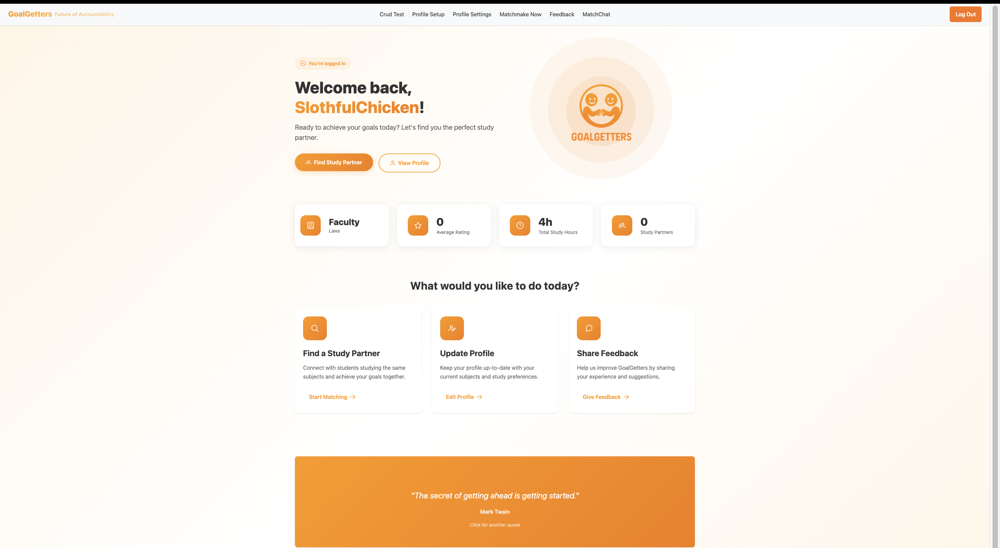

# GoalGetters
# 🏆 IS216 Web Application Development II

---

## Section & Group Number
**G3 Group 18**

---

## 👥 Group Members

| Photo | Full Name | Role / Features Responsible For |
|:--:|:--|:--|
|  | Muhammad Mikhail Ghazi bin Ridzuan | Team Lead / Developer / Database - Register/Login with Auth & Supabase Integration |
|  | Ong Zhe Hwee Alec | Core Developer - Matchmaking Algorithm & Chat Functionailty |
|  | Mok Qing Ling | Developer - Profiles, Match History + Review & API endpoints  |
|  | Tan Jordan | Developer - Map Integration & API endpoints |
|  | Yu Yan Chang | Developer - Onboarding Screens |
|  | Parikshit Sanganeria | Developer - App Feedback |

> Remeber to place your headshot thumbnails in the `/photos` folder (JPEG or PNG).

---

## 💡 Business Problem

Many students find it difficult to stay consistent, focused, and motivated when working toward their goals. They often have friends, but not the right peers who can help keep them accountable. Existing social or productivity applications do not effectively combine peer accountability with privacy and flexibility. Students need a simple and safe way to find others with similar goals and motivation levels who can support them in maintaining discipline and progress.
  
> **GoalGetters** solves this by pairing/connecting students with anonymous like-minded partners who share similar objectives, ensuring both privacy and productivity at the same time.


---

## 🌐 Web Solution Overview

### 👤 Intended Users

The primary users of GoalGetters are **SMU students** who are motivated to achieve their goals but struggle to maintain focus or consistency on their own. These students are eager to complete assignments, prepare for exams, or work toward personal objectives, but may get distracted or lose motivation without support from others. GoalGetters provides them with an easy way to find study or accountability partners who share similar ambitions.


### 🚀 What Users Can Do & Benefits
Core features and the benefit each provides:  

| Feature | Description | User Benefit |
|:--|:--|:--|
| 🔐 **Register/Login with Student Verification System** | Users can register/login using their SMU student email to ensure a safe and verified community | Builds trust by ensuring only legitimate students are part of the platform |
| 🕵️ **Anonymous Matching** | Each user is given a random avatar and a generated nickname to stay anonymous | Protects user identity |
| ⏳ **Filter** | Users can filter their prefered gender, modules, and study hours | Helps users find the most suitable potiential partners efficiently |
| 🗺️ **Map Suggestion Feature** | Google Maps API recommends meet-up spots | Simplifies planning and helps users locate available meeting/studying spots |
| 🤝 **Matching Algorithm** | The platform automatically matches users with others who share similar goals and schedules | Saves time and increases the chance of finding compatible potential study partners |
| 💬 **Chat Functionality** | Users can communicate through an in-app chat system to plan sessions or motivate each other | Encourages communication and support without the need for personal contact information being exchanged |
| ⭐ **Rating + Review System** | After each session, users can rate and review the experience. All reviews remain private and anonymous | Encourages reflection and improvement for future sessions |

---

## 🧰 Tech Stack

| Logo | Technology | Purpose / Usage |
|:--:|:--|:--|
|  | **HTML5** | Structure and content |
|  | **CSS3 / Bootstrap** | Styling and responsiveness |
|  | **JavaScript (ES6)** | Client-side logic and interactivity |
|  | **Vite** | Development server and build tool |
|  | **Vue.js 3** | Component-based frontend framework |
|  | **PrimeVue.js** | Component-based frontend framework |
|  | **Supabase** | Authentication and database services |


---

## Use Case & User Journey (TO DO: Once each of our Individual Functions is done!)

Provide screenshots and captions showing how users interact with your app.

1. **Landing Page**  
     
   - Displays the homepage with navigation options.

2. **Search Feature**  
     
   - Users can browse and filter items by criteria.

3. **User Dashboard**  
     
   - Shows saved data and recent activities.

> Save screenshots inside `/screenshots` with clear filenames.

---

## Developers Setup Guide

Comprehensive steps to help other developers or evaluators run and test your project.

---

### 0) Prerequisites
- [Git](https://git-scm.com/) v2.4+  
- [Node.js](https://nodejs.org/) v18+ and npm v9+  
- Access to backend or cloud services used (Firebase, MongoDB Atlas, AWS S3, etc.)

---

### 1) Download the Project
```bash
git clone https://github.com/RealStuff29/GoalGetters.git
cd GoalGetters
npm install
```

---

### 2) Configure Environment Variables
Create a `.env` file in the root directory with the following structure:

```bash
VITE_SUPABASE_URL= .env.example
VITE_SUPABASE_ANON_KEY= .env.example
```

> Never commit the `.env` file to your repository.  
> Instead, include a `.env.example` file with placeholder values.

---

### 3) Backend / Cloud Service Setup

#### Supabase (To Do: Need to edit this part)
1. Go to [Supabase Console](https://supabase.com/)
2. Create a new project.
3. Enable the following:
   - **Authentication** → Email/Password sign-in
   - **Supabase Database**
   - **Hosting (optional)** if you plan to deploy your web app
4. Copy the Supabase configuration into your `.env` file.

<!-- #### Optional: Express.js / MongoDB
If your app includes a backend:
1. Create a `/server` folder for backend code.
2. Inside `/server`, create a `.env` file with:
   ```bash
   MONGO_URI=<your_mongodb_connection_string>
   JWT_SECRET=<your_jwt_secret_key>
   ```
3. Start the backend:
   ```bash
   cd server
   npm install
   npm start
   ```

--- -->

### 4) Run the Frontend
To start the development server:
```bash
npm run dev
```
The project will run on [http://localhost:5173](http://localhost:5173) by default.

To build and preview the production version:
```bash
npm run build
npm run preview
```

---

### 5) Testing the Application

#### Manual Testing
Perform the following checks before submission:

| Area | Test Description | Expected Outcome |
|:--|:--|:--|
| Authentication | Register, Login, Logout | User successfully signs in/out |
| CRUD Operations | Add, Edit, Delete data | Database updates correctly |
| Responsiveness | Test on mobile & desktop | Layout adjusts without distortion |
| Navigation | All menu links functional | Pages route correctly |
| Error Handling | Invalid inputs or missing data | User-friendly error messages displayed |

#### Automated Testing (Optional)
If applicable:
```bash
npm run test
```

---

### 6) Common Issues & Fixes

| Issue | Cause | Fix |
|:--|:--|:--|
| `Module not found` | Missing dependencies | Run `npm install` again |
| `Firebase: permission-denied` | Firestore security rules not set | Check rules under Firestore → Rules |
| `CORS policy error` | Backend not allowing requests | Enable your domain in CORS settings |
| `.env` variables undefined | Missing `VITE_` prefix | Rename variables to start with `VITE_` |
| `npm run dev` fails | Node version mismatch | Check Node version (`node -v` ≥ 18) |

---

## Group Reflection

Each member should contribute 2–3 sentences on their learning and project experience.

> **Example Template:**  
> - *Mikhail:* 
> - *Alec:* 
> - *Jordan:* 
> - *Parikshit:* 
> - *QingLing:* 
> - *Yan Chang:* 

As a team, reflect on:
- Key takeaways from working with real-world frameworks  
- Challenges faced and how they were resolved  
- Insights on teamwork, project management, and problem-solving  

## Recommended IDE Setup

[VS Code](https://code.visualstudio.com/) + [Vue (Official)](https://marketplace.visualstudio.com/items?itemName=Vue.volar) (and disable Vetur).

## Recommended Browser Setup

- Chromium-based browsers (Chrome, Edge, Brave, etc.):
  - [Vue.js devtools](https://chromewebstore.google.com/detail/vuejs-devtools/nhdogjmejiglipccpnnnanhbledajbpd) 
  - [Turn on Custom Object Formatter in Chrome DevTools](http://bit.ly/object-formatters)
- Firefox:
  - [Vue.js devtools](https://addons.mozilla.org/en-US/firefox/addon/vue-js-devtools/)
  - [Turn on Custom Object Formatter in Firefox DevTools](https://fxdx.dev/firefox-devtools-custom-object-formatters/)

## Customize configuration

See [Vite Configuration Reference](https://vite.dev/config/).

## Project Setup

```sh
npm install
```

### Compile and Hot-Reload for Development

```sh
npm run dev
```

### Compile and Minify for Production

```sh
npm run build
```
