# GoalGetters
# 🏆 IS216 Web Application Development II

---

## Section & Group Number
**G3 Group 18**

---

## 👥 Group Members

| Photo | Full Name | Role / Features Responsible For |
|:--:|:--|:--|
|  | Muhammad Mikhail Ghazi bin Ridzuan | Team Lead / Developer / Database - Register/Login with Auth & Supabase Integration |
|  | Ong Zhe Hwee Alec | Core Backend/Frontend/Database Main Feature Developer - Matchmaking Views/Algorithm & Chat Functionailty + Logic Flows |
|  | Mok Qing Ling | Developer - Profiles, Match History + Review & API endpoints  |
|  | Tan Jordan | Developer - Map Integration & API endpoints |
|  | Yu Yan Chang | Developer - Onboarding Screens |
|  | Parikshit Sanganeria | Developer - App Feedback |

<!-- > Remeber to place your headshot thumbnails in the `/photos` folder (JPEG or PNG). -->

---

## 💡 Business Problem

Many students find it difficult to stay consistent, focused, and motivated when working toward their goals. They often have friends, but not the right peers who can help keep them accountable. Existing social or productivity applications do not effectively combine peer accountability with privacy and flexibility. Students need a simple and safe way to find others with similar goals and motivation levels who can support them in maintaining discipline and progress.
  
> **GoalGetters** solves this by pairing/connecting students with anonymous like-minded partners who share similar objectives, ensuring both privacy and productivity at the same time.


---

## 🌐 Web Solution Overview

### 👤 Intended Users

The primary users of GoalGetters are **SMU students** who are motivated to achieve their goals but struggle to maintain focus or consistency on their own. These students are eager to complete assignments, prepare for exams, or work toward personal objectives, but may get distracted or lose motivation without support from others. GoalGetters provides them with an easy way to find study or accountability partners who share similar ambitions.


### 🚀 What Users Can Do & Benefits
Core features and the benefit each provides:  

| Feature | Description | User Benefit |
|:--|:--|:--|
| 🔐 **Register/Login with Student Verification System** | Users can register/login using their SMU student email to ensure a safe and verified community | Builds trust by ensuring only legitimate students are part of the platform |
| 🕵️ **Anonymous Matching** | Each user is given a random avatar and a generated nickname to stay anonymous | Protects user identity |
| ⏳ **Filter** | Users can filter their prefered gender, modules, and study hours | Helps users find the most suitable potiential partners efficiently |
| 🗺️ **Map Suggestion Feature** | Google Maps API recommends meet-up spots | Simplifies planning and helps users locate available meeting/studying spots |
| 🤝 **Matching Algorithm** | The platform automatically matches users with others who share similar goals and schedules | Saves time and increases the chance of finding compatible potential study partners |
| 💬 **Chat Functionality** | Users can communicate through an in-app chat system to plan sessions or motivate each other | Encourages communication and support without the need for personal contact information being exchanged |
| ⭐ **Rating + Review System** | After each session, users can rate and review the experience. All reviews remain private and anonymous | Encourages reflection and improvement for future sessions |

---

## 🧰 Tech Stack

| Logo | Technology | Purpose / Usage |
|:--:|:--|:--|
|  | **HTML5** | Structure and content |
|  | **CSS3 / Bootstrap** | Styling and responsiveness |
|  | **JavaScript (ES6)** | Client-side logic and interactivity |
|  | **Vite** | Development server and build tool |
|  | **Vue.js 3** | Component-based frontend framework |
|  | **PrimeVue.js** | Component-based frontend framework |
|  | **Supabase** | Authentication and database services |


---

## Use Case & User Journey (TO DO: Once each of our Individual Functions is done!)

Provide screenshots and captions showing how users interact with your app.

1. **Landing Page before login**  
   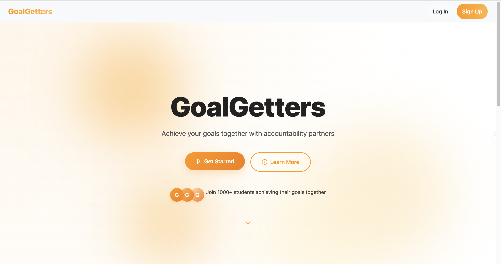  
   - Displays the homepage with navigation options before login.

2. **Login Page**  
   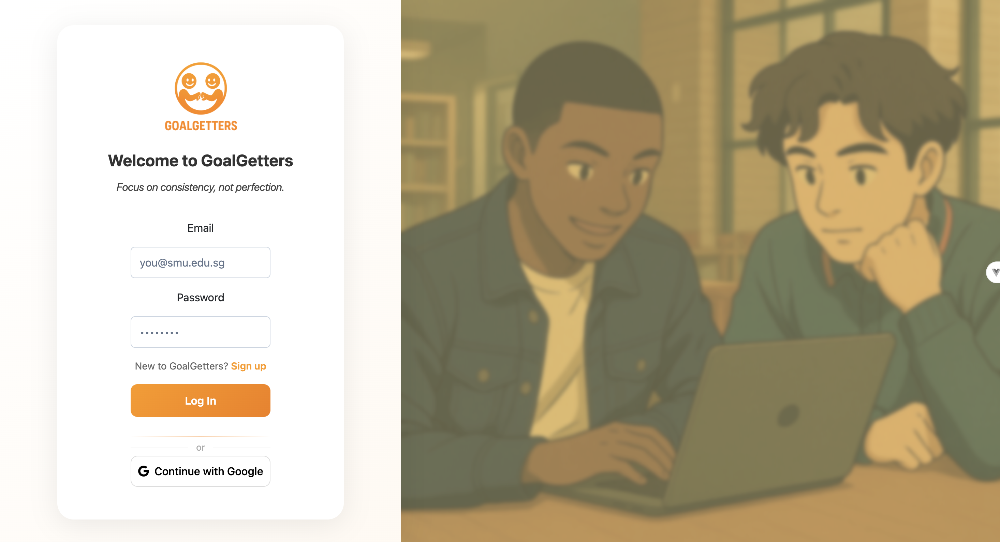  
   - Displays the login page.

3. **Landing Page after login**  
   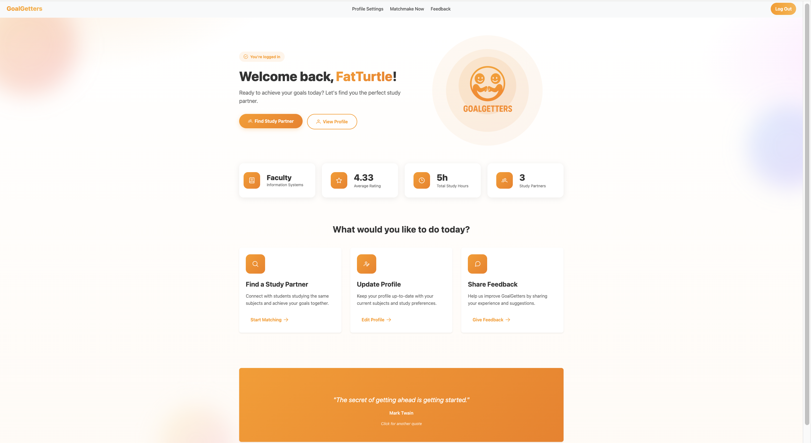  
   - Displays the homepage with navigation options after login.

4. **Profile Setup Feature**  

   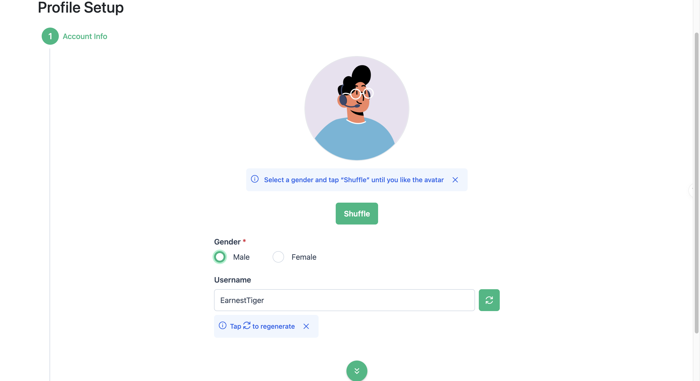  

   - Users select their gender and preferred username.  

   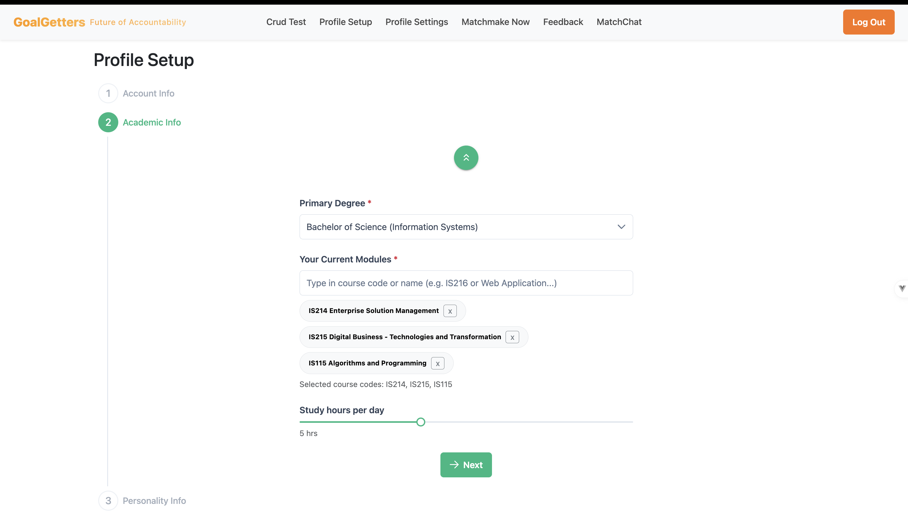  

   - Users choose their primary degree and modules.  

   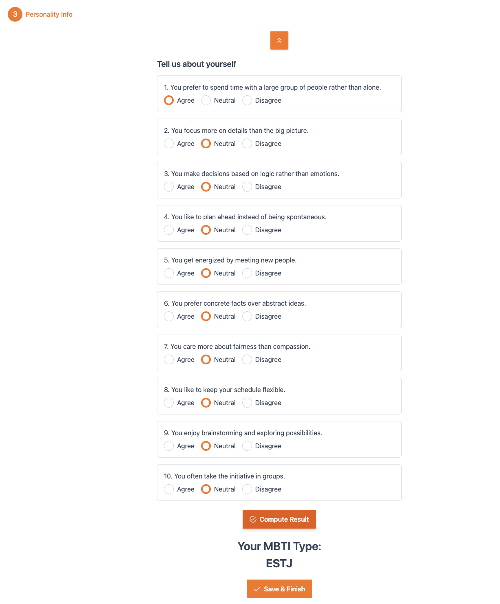    

   - Users take a personality quiz to discover their MBTI type.  

5. **Matchmaking Feature**  
   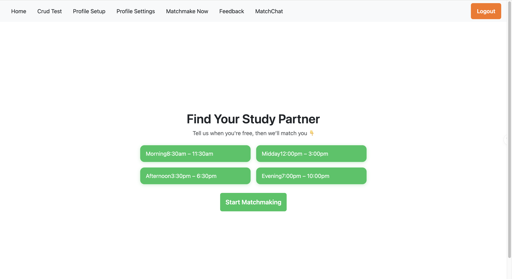  
   - Users pick preferred timeslots and start matchmaking.

6. **Match Search Feature**  
   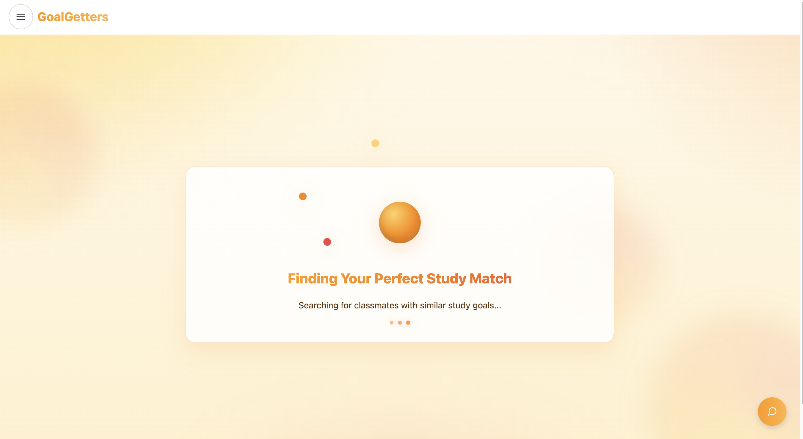  
   - The website searching for the user's match.

7. **Match Found Feature**  
   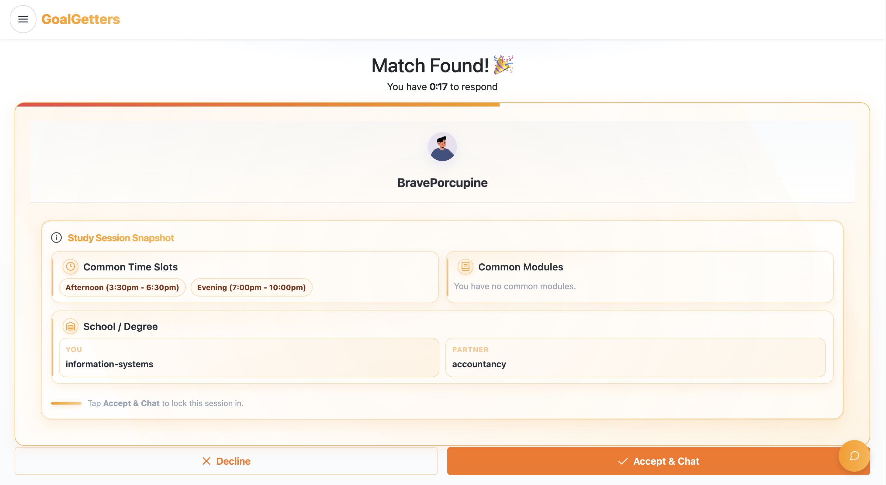  
   - Users can decline or accept the match.

8. **Session Details Feature**  
   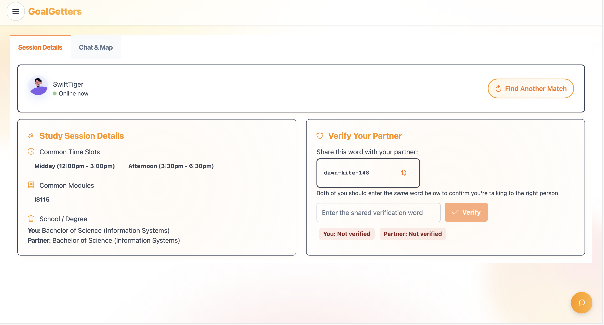  
   - Users can verfy their partner and see session details.

9. **Chat Feature**  
   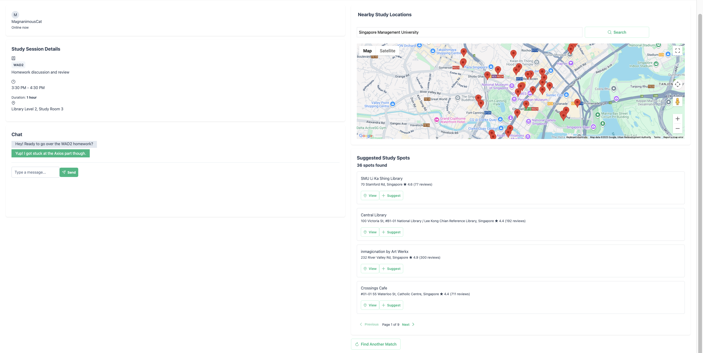  
   - Users can chat and find nearest study spots.

10. **Match Review Feature**  
   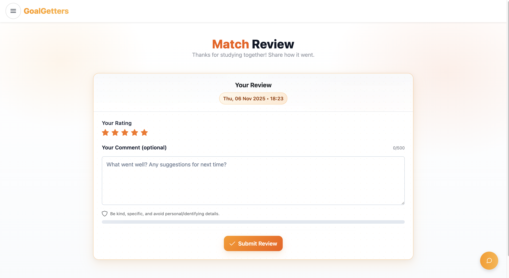  
   - Users can rate their match.

11. **User Dashboard**  
   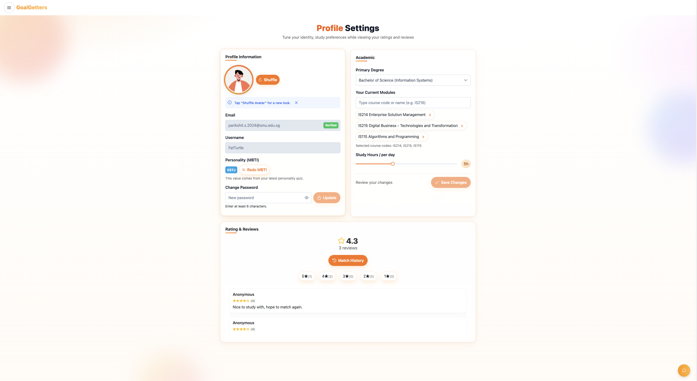  
   - Displays user profile info, match history, and ratings.

12. **Feedback Feature**  
   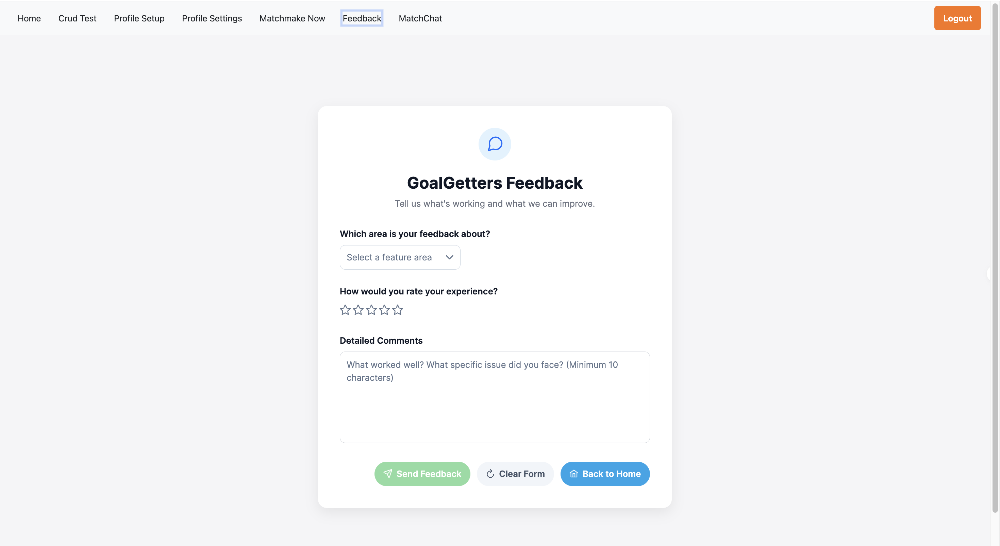  
   - Users provide feedback on the web application.

<!-- > Save screenshots inside `/screenshots` with clear filenames. -->

---

## Developers Setup Guide

Comprehensive steps to help other developers or evaluators run and test your project.

---

### 0) Prerequisites
- [Git](https://git-scm.com/) v2.4+  
- [Node.js](https://nodejs.org/) v18+ and npm v9+  
- Access to backend or cloud services used (Firebase, MongoDB Atlas, AWS S3, etc.)

---

### 1) Download the Project
```bash
git clone https://github.com/RealStuff29/GoalGetters.git
cd GoalGetters
npm install
```

---

### 2) Configure Environment Variables
Create a `.env` file in the root directory with the following structure:

```bash
VITE_SUPABASE_URL=<your_supabase_project_url>
VITE_SUPABASE_ANON_KEY=<your_supabase_anon_key>
VITE_GOOGLE_MAPS_API_KEY=<your_google_maps_api_key>
VITE_AVATAR_BASE=<your_avatar_base_url>
```

> Never commit the `.env` file to your repository.  
> Instead, include a `.env.example` file with placeholder values.

---

### 3) Backend / Cloud Service Setup

#### Supabase Setup
1. Go to [Supabase Console](https://supabase.com/)
2. Create a new project and note your project URL and anon key.
3. Enable:
   - **Authentication** → Email/Password sign-in
   - **Table Editor** → Create tables for profiles, matches, sessions, and feedback
4. Copy your Supabase credentials into the `.env` file.
5. Set up database policies to allow necessary authenticated actions (insert, select, update).

<!-- #### Optional: Express.js / MongoDB
If your app includes a backend:
1. Create a `/server` folder for backend code.
2. Inside `/server`, create a `.env` file with:
   ```bash
   MONGO_URI=<your_mongodb_connection_string>
   JWT_SECRET=<your_jwt_secret_key>
   ```
3. Start the backend:
   ```bash
   cd server
   npm install
   npm start
   ```

--- -->

### 4) Run the Frontend
To start the development server:
```bash
npm run dev
```
The project will run on [http://localhost:5173](http://localhost:5173) by default.

To build and preview the production version:
```bash
npm run build
npm run preview
```

---

### 5) Testing the Application

#### Manual Testing
Perform the following checks before submission:

| Area | Test Description | Expected Outcome |
|:--|:--|:--|
| Authentication | Register, Login, Logout | User successfully signs in/out |
| CRUD Operations | Add, Edit, Delete data | Database updates correctly |
| Responsiveness | Test on mobile & desktop | Layout adjusts without distortion |
| Navigation | All menu links functional | Pages route correctly |
| Error Handling | Invalid inputs or missing data | User-friendly error messages displayed |

#### Automated Testing (Optional)
If applicable:
```bash
npm run test
```

---

### 6) Common Issues & Fixes

| Issue | Cause | Fix |
|:--|:--|:--|
| `Module not found` | Missing dependencies | Run `npm install` again |
| `Supabase: permission-denied` | Supabase security rules not set | Update policies in Supabase |
| `CORS policy error` | Backend not allowing requests | Enable your domain in CORS settings |
| `.env` variables undefined | Missing `VITE_` prefix | Rename variables to start with `VITE_` |
| `npm run dev` fails | Node version mismatch | Check Node version (`node -v` ≥ 18) |

---

## Group Reflection

> - *Mikhail:* I learned how to handle user creation, session management, and regex with Supabase for our project over the course of working on the login and registration functions. I also got the chance to try my hand at using the Google API to implement the Oauth login using google accounts. For more general functionality, I learned how to setup and work with the routerguard function for our view project, booting the user to specific pages depending on their session/account data, as well as how layouts (Which we used for the navbar) work in a vue project!

> - *Alec:* I am the main feature developer for matchmaking & algorithmns, handling most of front/backend for matchmaking,chat,matchreview functionality. I have learnt to handle error and make dynamic responsive webside (without needing to hard refresh for changes on reactive elements/cards), while developing a robust logic system between multiple users (match declines, and dequeueing of member on both frontend and database) within a live platform. I have also learnt to integrated reactive notification and provide tactile UI responsiveness to provide user clarity. I have also applied enhancement to the backend supabase to cleanse untilisized data to keep the matchmaking fast and effecient. I have also designed learnt to make a Dynamic Navbar so that ChatMatch view only appears when there is a match to reduce clutter, applied animations (e.g Stars/Confetti/logos), and sound effects to the matchmaking experience.

> - *Jordan:* Working on this project allowed me to gain hands-on experience integrating multiple real-world frameworks and APIs. I implemented the Google Maps integration within the chat feature, enabling users to suggest and locate study spots based on a searched location. This deepened my understanding of how to handle external APIs and manage asynchronous data in a web application.
Additionally, I worked on setting up a Supabase real-time chat system that enables two matched users to communicate seamlessly. This experience strengthened my grasp of real-time data synchronization and database event handling. I also contributed to the UI design by creating and styling the home page using PrimeVue components and CSS, which enhanced both my front-end development and design sense.
This project taught me the value of clear communication, proper task division, and regular updates within a team. Using GitHub and task boards helped us stay organized and aligned. I also learned to break complex features into smaller milestones and adapt quickly when faced with new frameworks. Overall, the experience strengthened my technical confidence, teamwork, and problem-solving approach.

> - *Qing Ling:* Through developing the profile setup, profile settings and match review page, I gained firsthand experience in integrating frontend and backend systems using Vue and Supabase. I implemented the avatar API, database tables, functions, and triggers to automatically create and link user profiles upon registration and built dynamic data retrieval for displaying user information and module suggestions. I also helped to integrate the match chat timer to track study session durations, display session details from the database and redirect users to the match review page to submit and store their reviews. In addition, I creates a database trigger that triggers when a session ID is generated upon verification, it creates a corresponding session row to ensure reviews are stored and retrieved accurately. Working with Vue and Supabase taught me how to manage data flow effectively between systems while keeping the application responsive. Although our team initially faced coordination challenges, but we still managed to pull together and deliver our final product.

> - *Parikshit:* I developed the feedback system using Vue and Supabase, which deepened my understanding of database connectivity and real-time data handling. I also learned to optimise UI responsiveness, implement effective form validation, and integrate external APIs. Additionally, I gained hands-on experience in sending automated email feedback to users upon submission.

> - *Yan Chang:* I developed the onboarding screens, where I focused on creating a smooth and engaging user experience. Through this, I improved my skills in interface design and state management using Vue.js. I also learned the importance of cohesive design systems in ensuring a consistent app experience.

**Team Reflection:** As a team, we learned the importance of collaboration and version control while developing a full-stack web application. Working with real-world frameworks such as Vue and Supabase helped us better understand asynchronous operations, database design, and UI optimisation. We faced challenges with API integration and data synchronisation, but managed to overcome them through consistent testing, detailed code reviews, and open communication. Overall, this project strengthened our teamwork, problem-solving, and time management skills, giving us valuable experience for future software development projects.

## Recommended IDE Setup

[VS Code](https://code.visualstudio.com/) + [Vue (Official)](https://marketplace.visualstudio.com/items?itemName=Vue.volar) (and disable Vetur).

## Recommended Browser Setup

- Chromium-based browsers (Chrome, Edge, Brave, etc.):
  - [Vue.js devtools](https://chromewebstore.google.com/detail/vuejs-devtools/nhdogjmejiglipccpnnnanhbledajbpd) 
  - [Turn on Custom Object Formatter in Chrome DevTools](http://bit.ly/object-formatters)
- Firefox:
  - [Vue.js devtools](https://addons.mozilla.org/en-US/firefox/addon/vue-js-devtools/)
  - [Turn on Custom Object Formatter in Firefox DevTools](https://fxdx.dev/firefox-devtools-custom-object-formatters/)

## Customize configuration

See [Vite Configuration Reference](https://vite.dev/config/).

## Project Setup

```sh
npm install
```

### Compile and Hot-Reload for Development

```sh
npm run dev
```

### Compile and Minify for Production

```sh
npm run build
```
